# シス管系女子 ハンズオン

subtitle
:   試して覚えよう！ SSHポートフォワーディング

author
:   Piro / 結城洋志

institution
:   株式会社クリアコード

allotted_time
:   60m

# 使用するサーバーを準備しよう

踏み台になるサーバーと
社内専用Webサーバーを用意しよう

# 目指すゴール

（ネットワーク構成図）

# ローカルネットワークの作成 (1/5)

{:relative_height='95'}

# ローカルネットワークの作成 (2/5)

{:relative_height='95'}

# ローカルネットワークの作成 (3/5)

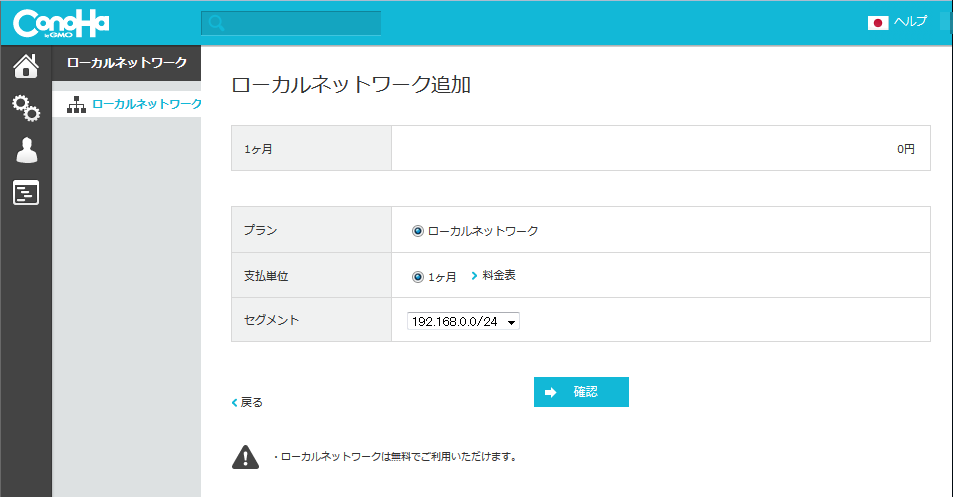{:relative_height='95'}

# ローカルネットワークの作成 (4/5)

{:relative_height='95'}

# ローカルネットワークの作成 (5/5)

{:relative_height='95'}

# 踏み台にするVPSの作成 (1/5)

{:relative_height='95'}

# 踏み台にするVPSの作成 (2/5)

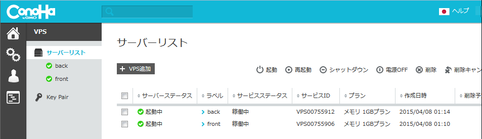{:relative_height='95'}

# 踏み台にするVPSの作成 (3/5)

{:relative_height='95'}

既定のテンプレートイメージで作成する。

# 踏み台にするVPSの作成 (4/5)

{:relative_height='95'}

# 踏み台にするVPSの作成 (5/5)

{:relative_height='95'}

# 踏み台にするVPSの名前の設定

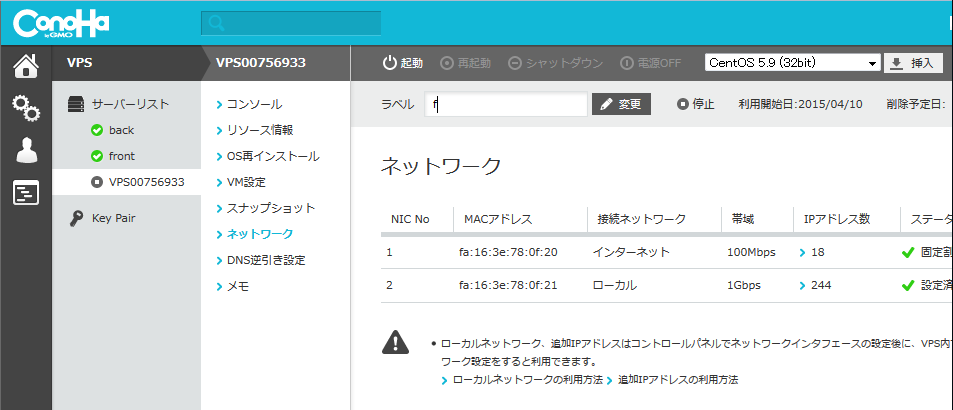{:relative_height='95'}

分かりやすいように「front」とラベルを付ける。

# 踏み台にするVPSのIPアドレスの確認

{:relative_height='95'}

以下の説明では203.0.113.1と仮定する。

# 踏み台にするVPSの設定 (1/8)

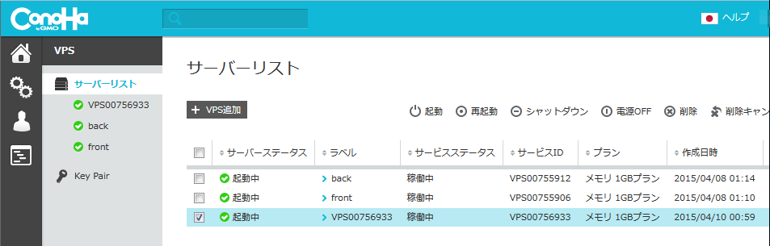{:relative_height='95'}

# 踏み台にするVPSの設定 (2/8)

{:relative_height='95'}

# 踏み台にするVPSの設定 (3/8)

{:relative_height='95'}

# 踏み台にするVPSの設定 (4/8)

{:relative_height='95'}

# 踏み台にするVPSの設定 (5/8)

{:relative_height='95'}

# 踏み台にするVPSの設定 (6/8)

{:relative_height='95'}

# 踏み台にするVPSの設定 (7/8)

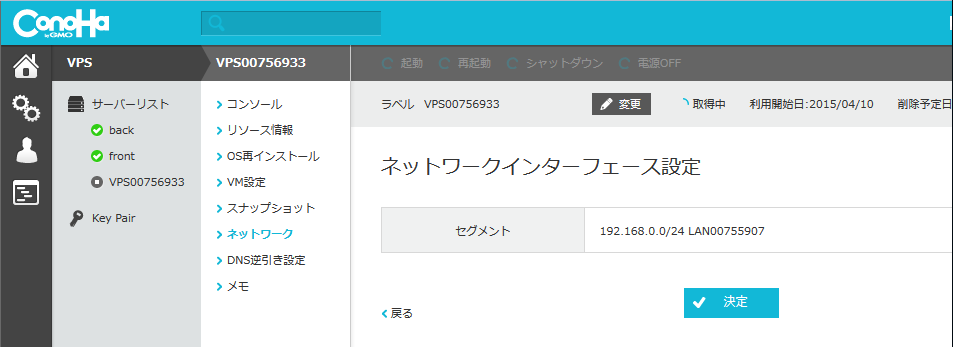{:relative_height='95'}

# 踏み台にするVPSの設定 (8/8)

{:relative_height='95'}

# 踏み台にするVPSの初期化 (1/10)

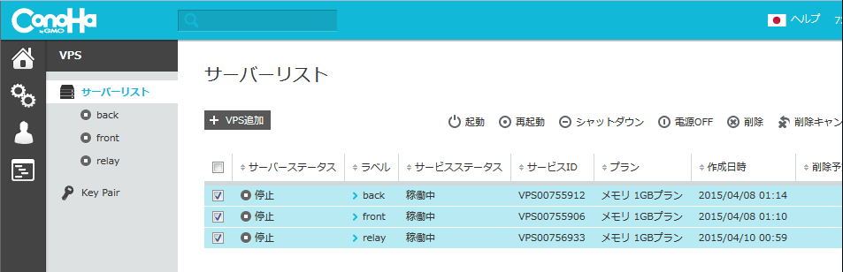{:relative_height='95'}

# 踏み台にするVPSの初期化 (2/10)

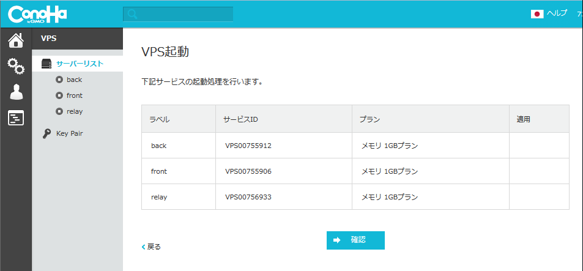{:relative_height='95'}

# 踏み台にするVPSの初期化 (3/10)

{:relative_height='95'}

# 踏み台にするVPSの初期化 (4/10)

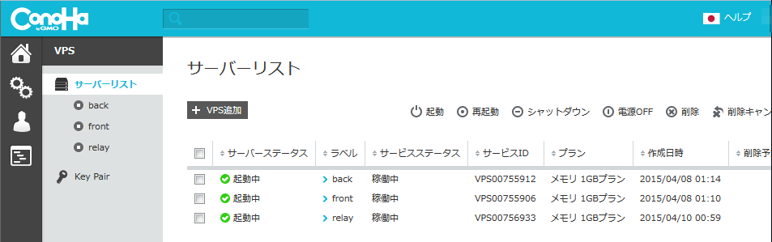{:relative_height='95'}

# 踏み台にするVPSの初期化 (5/10)

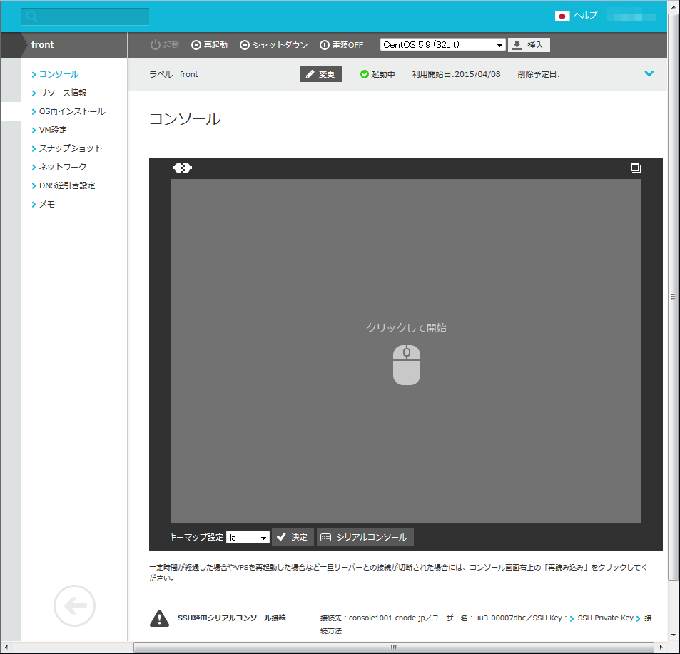{:relative_height='95'}

# 踏み台にするVPSの初期化 (6/10)

{:relative_height='95'}

# 踏み台にするVPSの初期化 (7/10)

{:relative_height='95'}

~~~
root@back# curl https://raw.githubusercontent.com/piroor/system-admin-girl-handson/master/script/setup-front.sh | bash
~~~

# 踏み台にするVPSの初期化 (8/10)

{:relative_height='95'}

# 踏み台にするVPSの初期化 (9/10)

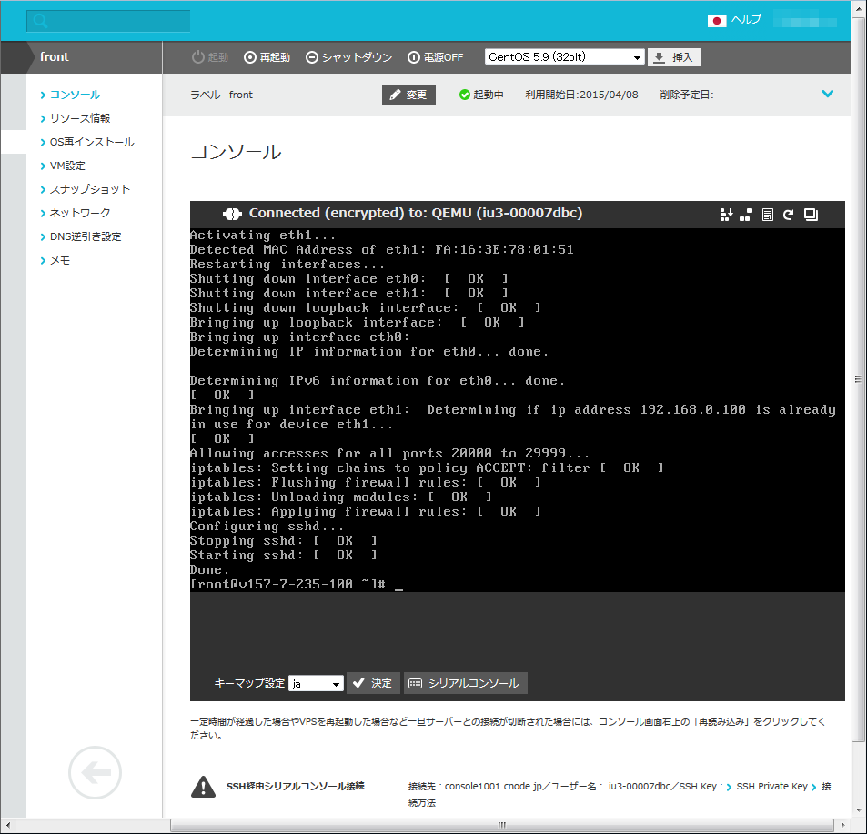{:relative_height='95'}

# 踏み台にするVPSの初期化 (10/10)

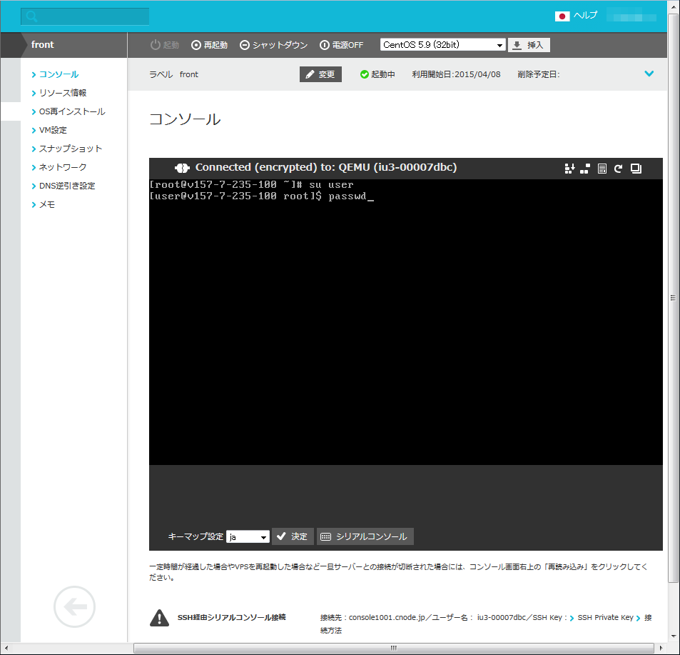{:relative_height='95'}

~~~
root@back# su user
user@back$ passwd
~~~

# 社内専用サーバーにするVPSの作成 (1/2)

{:relative_height='95'}

# 社内専用サーバーにするVPSの作成 (2/2)

{:relative_height='95'}

nginx, WordPress入りのテンプレートイメージを選択する。

# 社内専用サーバーにするVPSの名前の設定

{:relative_height='95'}

分かりやすいように「back」とラベルを付ける。

# 社内専用サーバーにするVPSのIPアドレスの確認

{:relative_height='95'}

以下の説明では203.0.113.2と仮定する。

# 社内専用サーバーにするVPSの設定

frontと同じ手順で、プライベートネットワークに参加させる。

 1. シャットダウン
 2. ネットワークインターフェースを追加
 3. 起動

# 社内専用サーバーにするVPSの初期化

frontと同じ手順で、スクリプトを使って初期化する。

スクリプトのダウンロードURLがfront用とは異なるので注意する。

~~~
root@back# curl https://raw.githubusercontent.com/piroor/system-admin-girl-handson/master/script/setup-back.sh | bash
~~~

初期化が完了したら、userユーザのパスワードを変更しておく。

~~~
root@back# su user
user@back$ passwd
~~~

# WordPressの動作確認 (1/3)

{:relative_height='95'}

backのIPアドレスを指定してブラウザで開いてみる。
初期設定の画面が出るので、適当に設定する。

例： http://203.0.113.2/

# WordPressの動作確認 (2/3)

{:relative_height='95'}

# WordPressの動作確認 (3/3)

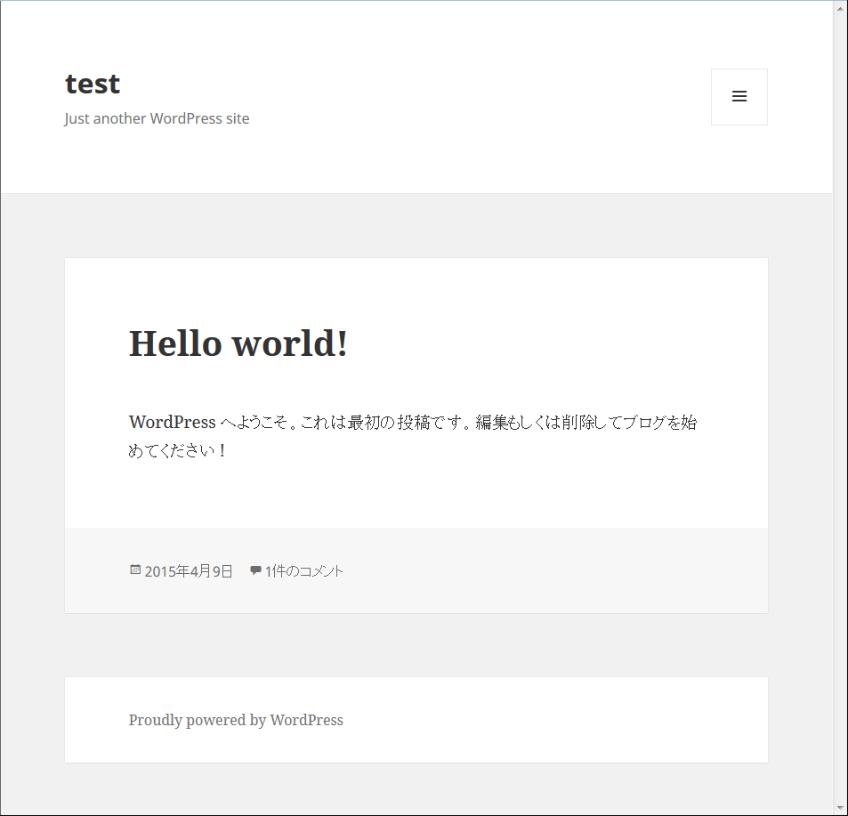{:relative_height='95'}

もう1度、backのIPアドレスを指定してブラウザで開いてみる。
セットアップが完了したWordPressの画面が出る。

例： http://203.0.113.2/

# 社内専用サーバーをインターネットから切り離す

backにログインし、root権限でrootのホームにある設定変更用スクリプトを実行する。

~~~
# ~/deactivate-eth0.sh
~~~

# 準備完了

（ネットワーク構成図）

# SSHポートフォワーディングを試してみよう

# ポートフォワーディングとは？

（概念図）

# Case0: ポートフォワードが必要ないケース

# Case0-1: 社外にあるPCから社内専用のサーバーにSSH接続したい

（ネットワーク構成図）

手元のPC：

~~~
$ ssh user@203.0.113.1
~~~

ログイン先の踏み台サーバー（front）：

~~~
user@front$ ssh user@192.168.0.110
~~~

（概念図）

# Case0-2: 社外にあるPCから社内専用のサーバーにSCPでファイルをアップロードしたい（または、ファイルをダウンロードしたい）

（ネットワーク構成図）

手元のPC：

~~~
$ echo "Hello!" >  /tmp/localfile
$ scp /tmp/localfile user@203.0.113.1:/tmp/uploadedfile
$ ssh user@203.0.113.1
user@front$ scp /tmp/uploadedfile user@192.168.0.110:/tmp/uploadedfile
~~~

（概念図）

一旦リモートのサーバに置いてから、もう1度コピーすることになる。

# Case1: ローカルフォワード（順方向のポートフォワード）

（概念図）

# Case1-1: 社外にあるPCから社内専用のサーバーにSCPで直接ファイルをアップロードしたい（または、ファイルをダウンロードしたい）

（ネットワーク構成図）

手元のPC：

~~~
$ ssh user@203.0.113.1 -L 10022:192.168.0.110:22
~~~

手元のPCの別コンソール：

~~~
$ scp -P 10022 /tmp/localfile user@localhost:/tmp/uploadedfile2
$ scp -P 10022 user@localhost:/tmp/uploadedfile2 /tmp/downloadedfile
~~~

（概念図）

大量のファイルを転送するならこの方がラク。

# Case1-2: 社外にあるPCから社内専用のサーバーにHTTP接続したい

（ネットワーク構成図）

社外から、社内にあるRedmineなどにアクセスする、というような場面。

手元のPC：

~~~
$ ssh user@203.0.113.1 -L 10080:192.168.0.110:80
~~~

手元のPCの別のコンソール：

~~~
$ curl -L "http://localhost:10080/"
~~~

（概念図）

# Case1-3: 社外にある他のPCからも社内専用のサーバーにHTTP接続したい

（ネットワーク構成図）

手元のPC：

~~~
$ ssh user@203.0.113.1 -L 10080:192.168.0.110:80 -g
~~~

同一セグメント内にある他のPC：

~~~
$ curl -L "http://192.168.1.10:10080/wp-admin/install.php"
~~~

（概念図）

# Case2: リモートフォワード（逆方向のポートフォワード）

（概念図）

# Case2-1: 社内のコンピューターから社外にあるPCにSSHでログインしたい

（ネットワーク構成図）

手元のPCの調子がおかしいので、社内にいる大野先輩に遠隔操作でトラブルシューティングしてもらう、というような場面。
手元のPCにはguestというユーザーを作成済みで、パスワード認証できるものとする。

手元のPC：

~~~
$ ssh user@203.0.113.1 -R 20022:localhost:22
~~~

社内にあるコンピューター（back）

~~~
user@back$ ssh user@192.168.0.100
user@front$ ssh -p 20022 guest@localhost
~~~

（概念図）

別解

~~~
user@back$ ssh user@192.168.0.100 -R 0.0.0.0:20022:localhost:22
~~~

社内にあるコンピューター（back）

~~~
user@back$ ssh -p 20022 guest@192.168.0.100
~~~

（概念図）

# Case2-2: インターネットに接続できる手元の携帯端末から、踏み台サーバーを経由して、手元のPCの上で動いているプレゼンツールを操作したい

（ネットワーク構成図）

http://rabbit-shocker.org/ja/rabbirack/

手元のPC：

~~~
$ ssh user@203.0.113.1 -R 0.0.0.0:20102:localhost:10102
~~~

手元の携帯端末

~~~
http://203.0.113.1:20102/
~~~

（概念図）

注意点：

 * 手元のPCをインターネットに公開しているのと全く同じなので、危険。
 * frontのsshdが、GatewayPorts yesまたはclientspecifiedに設定されている必要がある。
 * frontのiptablesで、指定のポートが解放されている必要がある。

# Case2-3: 外部から侵入不可能なネットワーク内にあるサーバーに、踏み台サーバーを経由して、手元のPCからSSH接続したい

frontに対して外部からのSSH接続を禁止して、「外には出て行けるが、中には入れない」ネットワークを用意する。

~~~
root@front# ./disallow-ssh.sh
~~~

確かめてみる。

~~~
$ ssh user@203.0.113.2
~~~

これはログインできない。

~~~
user@back$ ssh user@192.168.0.100
~~~

これはログインできる。

さらに、新たな踏み台サーバーとして、relay（203.0.113.3と仮定）を用意する。

~~~
root@relay# curl https://raw.githubusercontent.com/piroor/system-admin-girl-handson/master/script/setup-relay.sh | bash
root@relay# su user
user@relay$ passwd
~~~

（ネットワーク構成図）

frontからrelayへSSH接続して、リモートフォワードを設定する。

~~~
user@front$ ssh user@203.0.113.3 -R 20022:192.168.0.110:22
~~~

次に、手元のPCからrelayへSSH接続する。
そうしたら、localhostの20022番ポートにSSH接続する。

~~~
$ ssh user@203.0.113.3
user@front2$ ssh user@localhost -p 20022
~~~

（概念図）

# Case2-4: 外部から侵入不可能なネットワーク内にあるサーバーに、踏み台サーバーを経由して、手元のPCからHTTP接続したい

（ネットワーク構成図）

frontからrelayへSSH接続して、リモートフォワードを設定する。

~~~
user@front$ ssh user@203.0.113.3 -R 0.0.0.0:20080:192.168.0.110:80
~~~

手元のPC：

~~~
$ curl -L http://203.0.113.3:20080/
~~~

（概念図）

注意点：

 * サーバーをインターネットに公開しているのと全く同じなので、危険。
 * relayのsshdが、GatewayPorts yesまたはclientspecifiedに設定されている必要がある。
 * relayのiptablesで、指定のポートが解放されている必要がある。
 * front-relay間の接続が切れたらお手上げ。（自動再接続させたいならautosshを使う）

# Case3: ローカルフォワードとリモートフォワードの合わせ技

（概念図）

# Case3-1: 外部から侵入不可能なネットワーク内にあるサーバーに、踏み台サーバーを経由して、手元のPCからHTTP接続したい（より安全なやり方）

新たな踏み台サーバーとして、plain-relay（203.0.113.4と仮定）を用意する。

~~~
root@relay# curl https://raw.githubusercontent.com/piroor/system-admin-girl-handson/master/script/setup-plain-relay.sh | bash
root@relay# su user
user@relay$ passwd
~~~

 * plain-relayのsshdは、GatewayPorts noでもよい。
 * plain-relayのiptablesは、指定のポートが解放されていなくてもよい。
 * front-plain-relay間の接続が切れたらお手上げ。（自動再接続させたいならautosshを使う）

（ネットワーク構成図）

まず、frontからplain-relayへSSH接続して、リモートフォワードを設定する。

~~~
user@front$ ssh user@203.0.113.4 -R 20080:192.168.0.110:80
~~~

次に、手元のPCからplain-relayへSSH接続して、ローカルフォワードを設定する。

~~~
$ ssh user@203.0.113.4 -L 10080:localhost:20080
~~~

手元のPCの別のコンソール：

~~~
$ curl -L http://localhost:10080/
~~~

（概念図）

